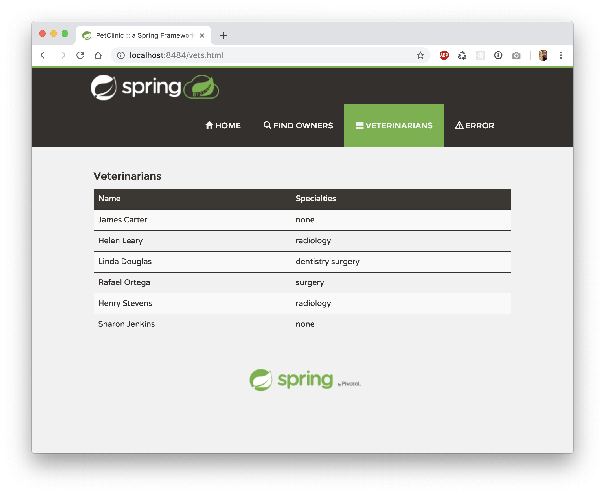

# Homework 8

## Docker
1. [Dockerfile](Dockerfile)
1. Running Docker instance as shown by a `ps` command

1. Local webpage

## Docker Compose - MySQL Only
1. [Output from `docker-compose up`](figures/docker-compose-output.txt)*
1. Local webpage - Veterinarians

1. [Running MySQL stack trace](figures/docker-mysql-stacktrace.txt)*

## Docker Compose - App Server & MySQL
1. [docker-compose.yml](docker-compose.yml)
1. [application-mysql.properties](src/main/resources/application-mysql.properties)
1. [Output from `docker-compose up`](figures/docker-compose-both-output.txt)*
1. Local webpage - Veterinarians

*Output was too long to screen capture
