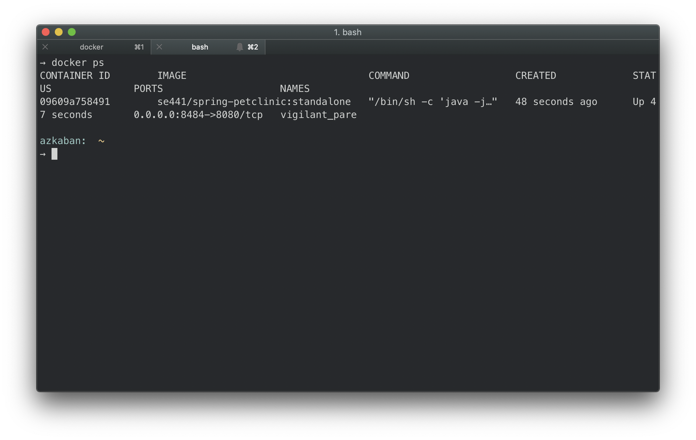
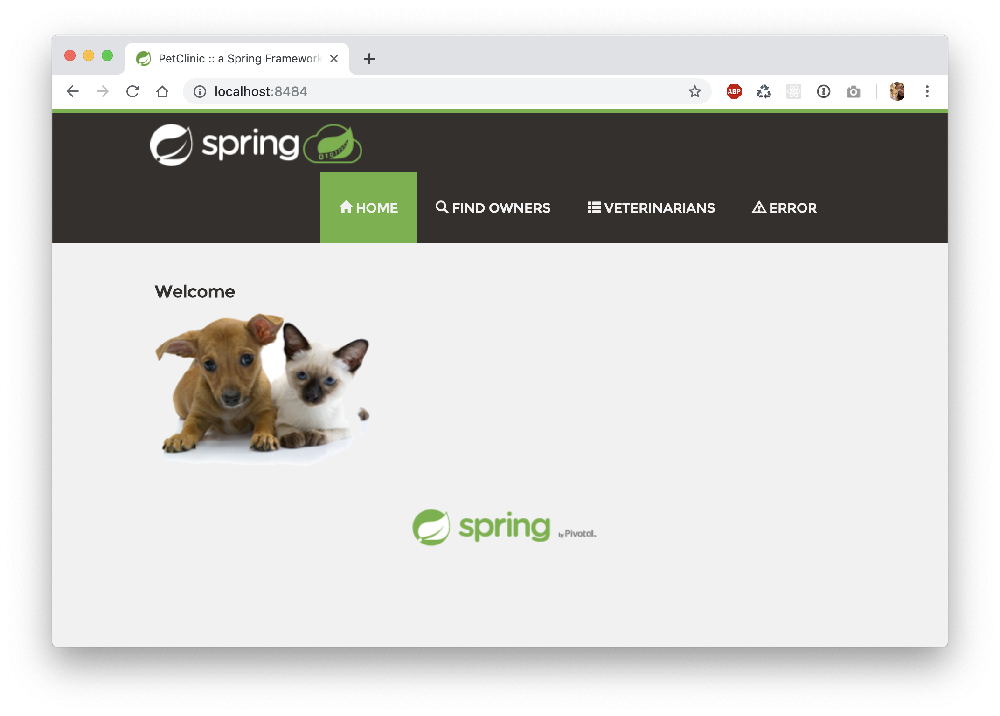

# Homework 8

## Docker
1. [Dockerfile](Dockerfile)
1. Running Docker instance as shown by a `ps` command

1. Local webpage

## Docker Compose - MySQL Only
1. Output from `docker-compose up`
1. Local webpage - Veterinarians
1. Running MySqL stack trace

## Docker Compose - App Server & MySQL
1. [docker-compose.yml](docker-compose.yml)
1. [application-mysql.properties](application-mysql.properties)
1. Output from `docker-compose up`
1. Local webpage - Veterinarians
